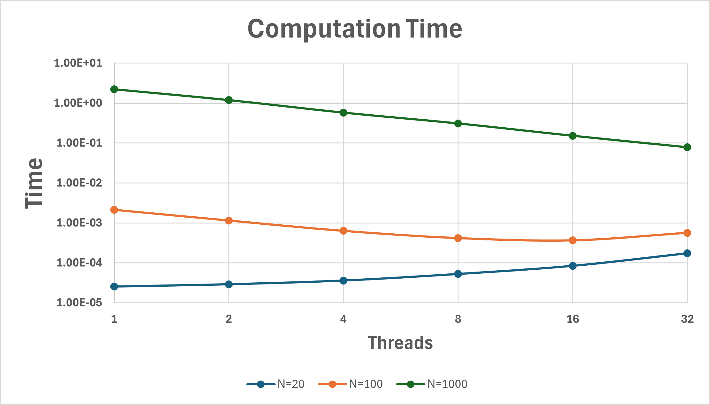

# Project 4

## Part 1: OpenMP Matrix-Matrix Multiplication

### 1.1 Solution 

See code `Part1.cpp`.

### 1.2 Solution

At threads = 1, the openmp vs non-openmp code run in virtually the same time with openmp version requiring more time due to the overhead of initializing openmp. At higher thread values, the openmp code runs with a lesser time compared to serial code, in general (see Part 1.4 for exact numbers).

=> The code runs as expected.

### 1.3 Solution

The thread-to-thread speedup study was performed for threads 1 to 32 (in powers of 2). See Part 1.4 for results.

### 1.4 Solution

See figure below for time taken to compute using various number of threads for different matrix sizes. 

For low matrix size, the time for computation slightly increases with the number of threads. This is because engaging multiple threads for a very small matrix does not pay off and instead causes overhead time. For medium matrix size, the time for computation decreases initially, then stops changing and then starts increasing as the threads are increased. This is due to the same reason stated earlier---after a certain number of threads, the parallelization does not pay off. However, for a high matrix size, we see that the time continuously decreases with increases in number of threads used. 

See figure below for scaling/parallel efficiency achieved using variuos number of threads for different matrix sizes. 

The scaling/efficiency was computed by the following formula:
$E = \frac{T_1}{p*T_p}$
where $E$ is the efficiency, $T_1$ is the time for single thread, $p$ is the number of threads adn $T_p$ is the time for $p$ threads. 

The scaling plot shows the same trend as the time plot. For low matrix size, the efficiency decreases as more threads are unnecessarily engaged, and the parallelization does not pay off. For medium matrix size, the efficiency is initially high at max thread count where it starts increasing again. This is due to the same reason stated earlier---after a certain number of threads, the parallelization overhead outweighs its benefit. However, for a high matrix size, we see that the efficiency is almost about 90% for all threads and slightly less than 90% for the max thread. This shows that for high matrix sizes, the parallelization with OpenMP performs sufficiently well in reducing the computation time.

### 1.5 Solution

**Verified**. Both parallel and serial codes were run for the same matrices using different number of threads. The computed result was the same for each. 

See example outputs below for threads 2 and 4 respectively using a matrix size of 5:

## Part 2: Adding OpenMP threading to a simple MPI Application 

### 2.1 to 2.4 Solution 

See code `Part2.cpp`.

### 2.5 Solution

I modified the "Hello World!" output slightly so that I could more accurately determine what was going on. We can see the rsults of running `Part2.cpp` below:
   
    Hello, World! from omp thread 1 on MPI rank 0
    Hello, World! from omp thread 0 on MPI rank 0
    Hello, World! from omp thread 2 on MPI rank 0
    Hello, World! from omp thread 3 on MPI rank 0
    Hello, World! from omp thread 1 on MPI rank 1
    Hello, World! from omp thread 0 on MPI rank 1
    Hello, World! from omp thread 2 on MPI rank 1
    Hello, World! from omp thread 3 on MPI rank 1

We can see that each rank of MPI compiles the entire code and runs it (as expected). Within each MPI rank it encounters the OMP parallelized block, which we have assigned to 4 threads. It runs each of these 4 threads which return in a random order each time (as expected again) each thread with its own individual "Hello World!". This gives us a total of 8 "Hello World!"s coming from 4 threads*2ranks. 

## Part 3 Hybrid Parallel Matrix Multiplication

### 3.1 Solution
See code `Part3.cpp`. The output matrix is recorded in Part3_1_matrixC.txt. The two input matrices are recorded in Part3_1_matrixA.txt and Part3_1_matrixB.txt. When the same inputs were given, the result was not impacted by changing the number of OpenMP threads or MPI ranks.

### 3.2 Solution

The above three figures, with different matrix sizes, all showed similar tendencies of rapid drops in time as OpenMP thread = 1 when the MPI rank is before rank 2. When more threads are used, the elapsed time gets shorter. When more MPI ranks are used, elapsed time gets slightly shorter, but the change in time is not as much as the change of the number of threads used. When the matrix size is larger, more time is needed to complete the matrix multiplication. 

When only one thread is used, the increase in MPI ranks can affect the time efficiency more. Also, the number of physical cores and memory bandwidth can limit performance gains, therefore, the efficiency drops when the rank increases to 4.
